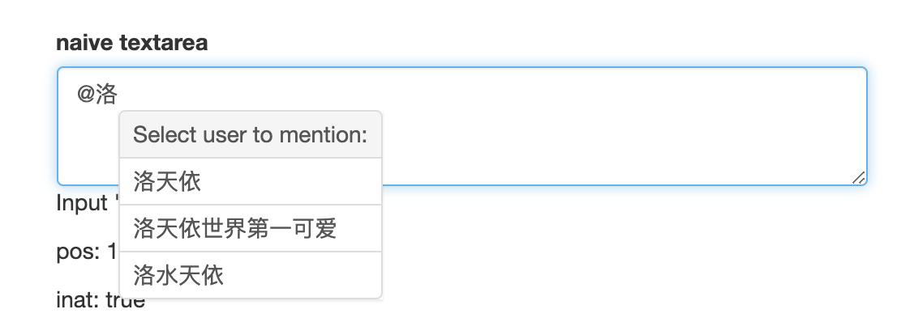

# Naive Textarea

A naive textarea which support '@' user function.

## File structure
`index.html` Textarea view.

`naive-textarea-vue` Vue related javascript code.

`textarea-caret-position.js` Get caret position function referred from [component/textarea-caret-position](https://github.com/component/textarea-caret-position).

## Requirements
[Vue.js](https://vuejs.org)

[Bootstrap](https://getbootstrap.com)

## Online demo
`TODO`

## Reference
The `textarea-caret-position.js` file provides `getCaretCoordinates` function comes from [component/textarea-caret-position](https://github.com/component/textarea-caret-position)
